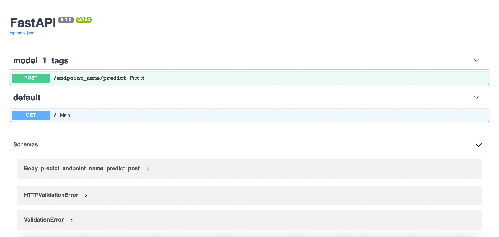

[](LICENSE)
# FastAPI-Model-Deployement
Template of simple API for machine learning models deployment 



# How to use it 

You can run the backend service directly on your machine, use `docker-compose` to deploy it on a VPS or build it as an image and use that as a backbone of AWS Lambda 

## Simple run
`docker-compose.yaml` should look like that:
```yaml
version: '3.7'
services:
  model_api:
    build: .
#    image: <user>/<docker-image-name>:latest
    ports:
      - "8011:80"
```
and just run

```
docker-compose up
```

The service will be avalible at: [127.0.0.1:8011/docs](http://127.0.0.1:8011/docs)

## On VPS, EC2 or similar services

We use automatic docker build and push using Github Actions. So eveyryting you need to do is to commit you changes, update values in `docker.yml` and `docker-compose.yaml` and that is basicly it, you are good to go

1. Update [docker._yml](.github/workflows/docker._yml)

*disclaimer: update this values directly on gihtub, don't push it from the repo (it is possible but requires additional actions) 

Rename it to `docker.yml`

Set `DOCKER_USERNAME` and `DOCKER_PASSWORD` in your repository secrets

Replace line 34 `repository: <user>/<docker-image-name>:latest` with the proper repository name (the one to which you want to push it)

Save it

2. Modify `docker-compose.yaml`

Replace `<user>/<docker-image-name>` in [docker-compose.yaml](docker-compose.yaml), comment `build` and commit the change

```yaml
version: '3.7'
services:
  model_api:
#    build .
    image: <user>/<docker-image-name>:latest
    ports:
      - "81:80"
```

3. Clone your repo on a remote machine

```bash
git clone <link-to-your-repo>
```

4. Run `docker-compose up` on remote machine

```bash
docker-compose up
```

## With AWS Lambda or similar services


## Authors
- [Piotr Mazurek](https://github.com/tugot17)
